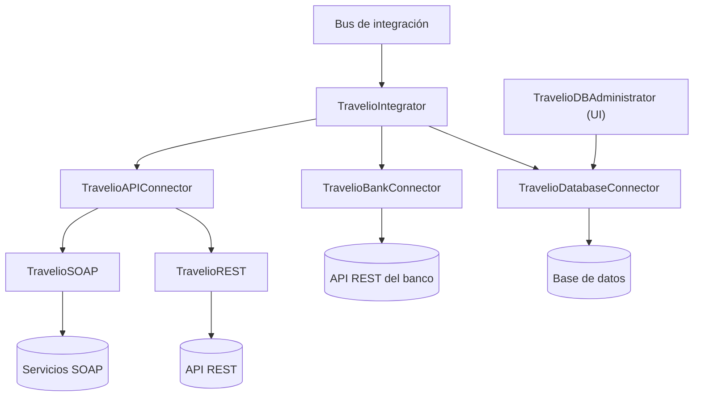

# Travelio

Conjunto de proyectos que construyen el bus de integración de Travelio. El código está en desarrollo y algunas capas estan incompletas.

## Proyectos de la solución
- **TravelioREST**: Conecta el bus de integración con cada API REST indicada por URL.
- **TravelioSOAP**: Conecta el bus de integración con servicios SOAP según la URL configurada.
- **TravelioAPIConnector**: Abstrae la conexión a API, ya sean SOAP o REST, y deja abierta la posibilidad de soportar gRPC o GraphQL en el futuro.
- **TravelioBankConnector**: Conecta el bus de integración con la API REST del banco.
- **TravelioDatabaseConnector**: Manipula la base de datos del bus de integración usando Entity Framework Core.
- **TravelioIntegrator**: Orquesta las capas anteriores; se conecta con la base de datos, el banco y las API para automatizar cargas de datos hacia la base de datos.
- **TravelioDBAdministrator**: Provee una interfaz ASP.NET Core para administrar la base de datos a través de TravelioDatabaseConnector. Esta capa podría eliminarse o cambiarse según la estrategia de front-end.

## Diagrama de relacion

## Estado
El codigo aún no está completo; varias capas pueden cambiar conforme avance el desarrollo.
