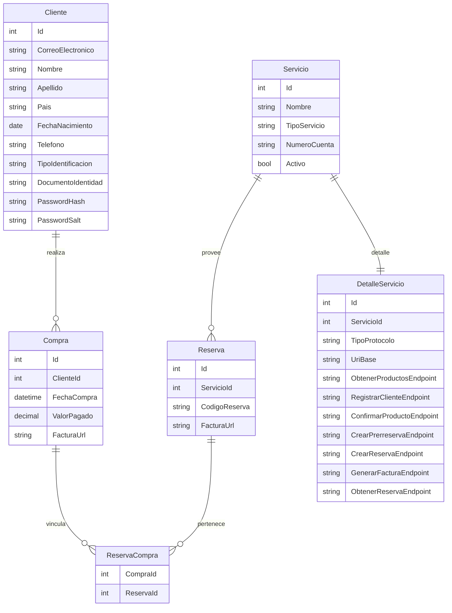

# TravelioDatabaseConnector

Código de acceso a datos con Entity Framework Core para SQL Server. Incluye tablas requeridas, hash de contraseñas con SHA-256 + sal y datos seed para Servicio/DetalleServicio.

## Dónde colocar DbContextOptionsBuilder
- Usa `Data/SqlServerContextFactory.cs` para instanciar `TravelioDbContext` con SQL Server local (cadena por defecto: `Server=localhost;Database=TravelioDb;Trusted_Connection=True;TrustServerCertificate=True;MultipleActiveResultSets=True;`).
- Para crear la base programáticamente:
  ```csharp
  await SqlServerContextFactory.EnsureDatabaseAsync(); // opcional: pasa tu cadena de conexión
  ```
- Para usar el contexto en tu app:
  ```csharp
  await using var ctx = SqlServerContextFactory.CreateContext();
  // ctx.Clientes.Add(...); await ctx.SaveChangesAsync();
  ```

## Crear la base de datos y migraciones (SQL Server local)
1) Instala la CLI de EF Core (si no la tienes):  
   `dotnet tool install --global dotnet-ef`
2) (Opcional) Exporta una cadena de conexión propia:  
   `set TRAVELIO_SQLSERVER_CONNECTION=Server=localhost;Database=TravelioDb;Trusted_Connection=True;TrustServerCertificate=True;MultipleActiveResultSets=True;`
3) Genera la migración inicial:  
   `dotnet ef migrations add InitialCreate --project TravelioDatabaseConnector --startup-project TravelioDatabaseConnector`
4) Aplica la migración a SQL Server:  
   `dotnet ef database update --project TravelioDatabaseConnector --startup-project TravelioDatabaseConnector`

El seeding de datos de ejemplo para `Servicio` y `DetalleServicio` se ejecutará al aplicar las migraciones.

## Diagrama ER

